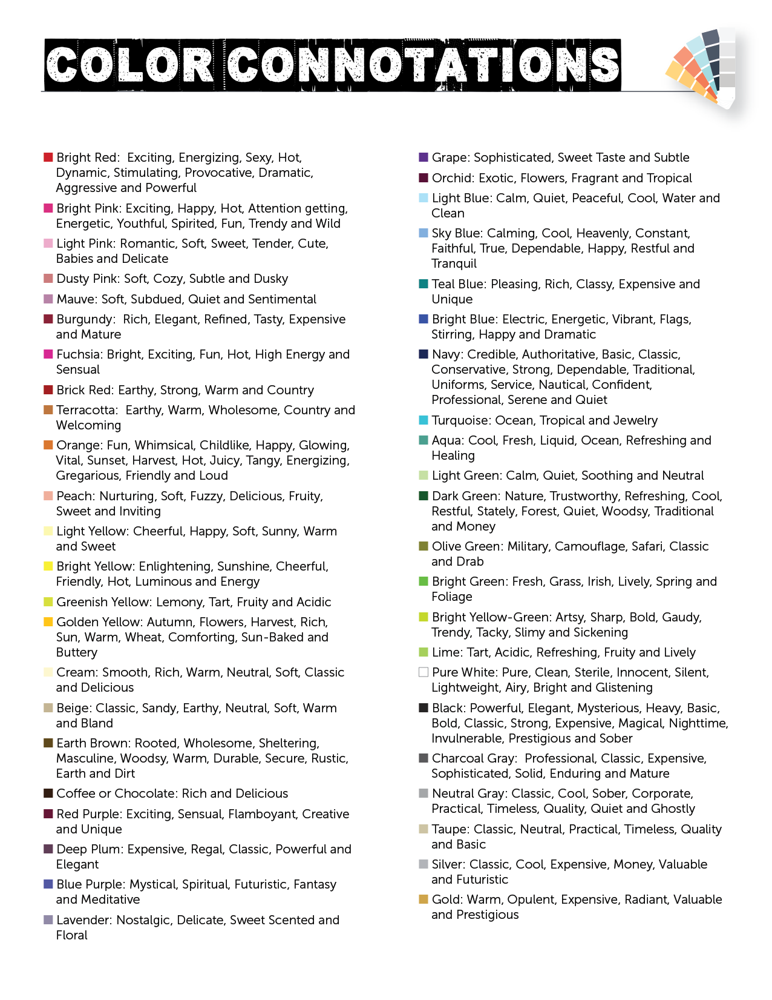

# Web Dev General Info
 

##HTML

[mdn web docs](https://developer.mozilla.org/en-US/docs/Web/HTML)

##CSS
[mdn web docs](https://developer.mozilla.org/en-US/docs/Web/CSS)

##Colors

###Color Theory

Helpful Color Harmony Links:

* [Coolors (use space bar, lock and save)](https://coolors.co/)
* [Color Hunt](https://colorhunt.co/)
* [HTML Color Codes](https://htmlcolorcodes.com/)
* [Computer Science Field Guide - RGB Mixer](https://www.csfieldguide.org.nz/en/interactives/rgb-mixer/)
* [Colors by Culture](https://webdesignerdepot.com/color-and-cultural-design-considerations/)
* [Find the styles of a website](http://stylifyme.com/)
* [Adobe Color](https://color.adobe.com/create/color-wheel/)
* [Paletton](https://paletton.com/#uid=1000u0kllllaFw0g0qFqFg0w0aF)
* [Mud Cube (color blindness options)](https://colorsphere.app/#dot=false&harmony=Neutral&hue=0&saturation=100&lightness=50&quantize=0&space=RYB&theme=dark&vision=Normal)
* [Material Palette](https://www.materialpalette.com/)
* [Color Hail Pixel](https://color.hailpixel.com/)
* [Pantone](https://www.pantone.com/)
* [Adobe Capture CC](https://www.adobe.com/products/capture.html)

###Color Connotations

Have you ever wondered how popular color
idioms came about? Do you look at the world
with rose colored glasses, or are you green with
envy, maybe even seeing red? Clearly, colors
evoke a variety of feelings and, when used
wisely, can be one of the most significant
marketing strategies there is.

Color responses can be both innate and
culturally learned. Take, for example, the fact
that white is the wedding color of the West and
the funeral color of the East. Additionally,
purple, the color of royalty, was not only
chosen for its deep rich hue but also because
of the timely expenditure to obtain the dye
(drop-by-drop from a shell fish), thus making it
incredibly expensive. Innate responses of anger and excitement to colors like red are more
physiological. Red causes the pituitary gland to
produce epinephrine. Blue, on the other hand,
is associated with loyalty and trustworthiness
because it is perceived as a constant—the sky
and the ocean are always there. (Are you
feeling manipulated by almost every corporate
blue logo right now)?

As you work through finding the perfect
responsive color combination for a given
project, remember that the human eye is
always stimulated by diversity and novelty.
Having a sophisticated understanding of color
will engage and influence your viewers beyond
standard connotations.

## JavaScript
[mdn web docs](https://developer.mozilla.org/en-US/docs/Web/JavaScript)

##jQuery

##Unix Command Line

##EJS

##Git, GitHub & Version Control

## APIs (Application Programming Interfaces

##Databases

##SQL

##PostgreSQL

##Authentication & Security

##React.js

##MySQL

##MongoDB

